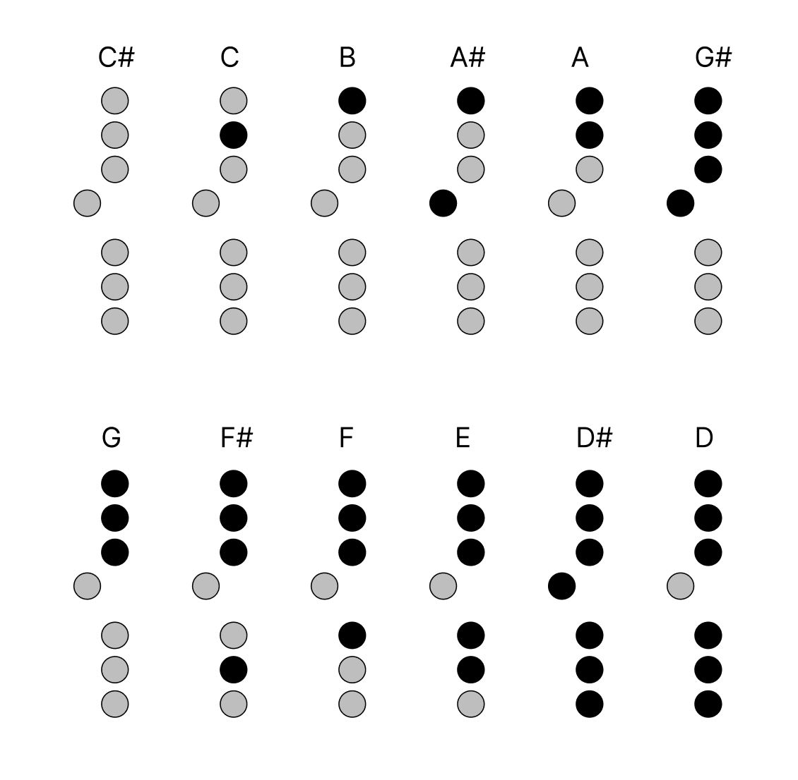

# Airflute  :notes:

Airflute is a home-made flute synthetizer over bluetooth, that was realized as
part of the [ARTISHOW](https://artishow.r2.enst.fr/) project at [Télécom
Paris](https://www.telecom-paris.fr/en/home). It has the shape of a flute, and
uses the MIDI protocol and a Bluetooth Lower Energy (BLE) connection to send
notes to your favourite synthethiser software on your computer. 

It can be used to:

- Play almost any instrument you like while only knowing how to play the flute.
- Learn music without causing bleeding ears to everyone (because you can use
  your headphones on your computer, and you'll be the only one to hear your
  awful music)

It was created using the [Zephyr RTOS Project](https://zephyrproject.org/) on
the [Nordic XIAO BLE SENSE](https://wiki.seeedstudio.com/XIAO_BLE/) board.


## Table of Contents

- [Table of Contents](#table-of-contents)
- [Creating the flute](#creating-the-flute)
- [Building the project](#building-the-project)
    - [Requirements](#requirements)
    - [Building the project](#building-the-project-1)
- [Playing the flute](#playing-the-flute)
- [Contact us](#contact-us)


## Creating the flute

We used:
- a [XIAO BLE SENSE](https://wiki.seeedstudio.com/XIAO_BLE/)
- some [phototransistors](https://www.vishay.com/en/product/83751/) (We couldn't
  find the exact ref on Vishay, [here](https://www.mouser.fr/ProductDetail/Vishay-Semiconductors/CNY70?qs=%2Fjqivxn91cdreAm7vR28%252BA%3D%3D)
  are the exact ones we used).
- an I/O expander [PCF8574](https://www.ti.com/product/PCF8574?utm_source=google&utm_medium=cpc&utm_campaign=asc-null-null-GPN_EN-cpc-pf-google-eu&utm_content=PCF8574&ds_k=PCF8574&DCM=yes&gad_source=1&gclid=Cj0KCQiA6Ou5BhCrARIsAPoTxrDwcCHukND1BMma5ikjd33tWuuZgeDsfNfS1Qkl7ALI4S8Av42yHtQaApNOEALw_wcB&gclsrc=aw.ds)
- A 3.7V 250mAh Lithium Battery to power the flute.
- a 3D printer, and some additionnal crafting stuffs


To detect the fingers on the holes of the flute, we uses the phototransistors.
A regular flute should have 10 holes. The thing is, on a real flute overlay,
somme holes are very very close to each other. This is why we decided only to
use 8 sensors, and to modify the real fingerings to something that whould fit
on 8 holes (you can see them [here](#playing-the-flute)).

However, 8 GPIO pins only for this would be kind of overkill, and it was also
interesting for use to experiment with i2c, which is the reason why we actually
use a I/O expander controled with i2c. In case you want to add more holes, you 
only have to chain the expanders (up to 8), and rewrite a portion of the code.

We also needed to know if somebody is blowing into the flute or note. We decided
to make our own sensor, inspired by [this youtube
video](https://www.youtube.com/watch?v=es92GqYBge0) by
[KontinuumLAB](https://www.youtube.com/@KontinuumLAB), using the
phototransistors and a membrane made of balloon.
If you blow, the membrane expands and is closer to the phototransistor. We then
read the sensor using the ADC, and can, with calibration, decide the intensity of
the blow.

As it began to be hard to fit everything in the flute (there were lots of wires due 
to the number of sensor, and the expander), we decide to make a PCB, on which we
welded all the components. You can find it [here](#).

Of course, we want our flute to look like one, and not just sensors wired to a
board, so we 3D printed the mouthpiece [mouthpiece.stl](hardware/mouthpiece.stl), a body
[body.stl](hardware/body.stl), and a horn [horn.stl](hardware/horn.stl). Alternatively, you can use a PVC pipe
for the body.


## Building the project

### Requirements

- [Zephyr RTOS and SDK](https://docs.zephyrproject.org/latest/develop/getting_started/index.html)

> **Note:** The project was developed using [Zephyr RTOS
> v.3.6](https://github.com/zephyrproject-rtos/zephyr/releases/tag/v3.6.0) and
> [SDK
> v0.16.5-1](https://github.com/zephyrproject-rtos/sdk-ng/releases/tag/v0.16.5-1).
> If you encounter any issues with other versions, please try using this
> version.


### Building the project

Here are the steps to build the project for the [Nordic XIAO BLE
SENSE](https://wiki.seeedstudio.com/XIAO_BLE/) board:

1. Clone the repository:

```bash
git clone https://github.com/paulmialane/airflute.git
```

2. Navigate to the zephyr project directory:

```bash
cd path/to/zephyrproject
```

3. Source the Zephyr environment:

On Linux or MacOS:
```bash
source path/to/zephyr-env/bin/activate
```
On WindowsPowerShell:
```bash
path/to/zephyr-env\Scripts\Activate.ps1
```

4. Build the project:

```bash
west build -b xiao_ble_sense path/to/airflute
```

5. Flash the project:

On the XIAO BLE SENSE board, press the reset button twice to enter the
bootloader mode. Then, copy the generated `zephyr.uf2` file of the `build`
folder to the device.

You can use the shell or you can directly drag and drop the `zephyr.uf2` file
to the device using the file explorer.


## Playing the flute

### Connecting the flute

1. Install a synthesizer on your computer that can connect to MIDI devices.
   Depending on the software you might need to install a soundfont to get the
   flute sound. For a simple use on Linux we recommend installing [QSynth](https://qsynth.sourceforge.io/) and
   adding the soundfont of your choice.

   Alternatively, you can use an android app that can connect to MIDI devices. We
   recommend using `FluidSynth MIDI Synthesizer` available on the Play Store.

> Note: We also tested on MAC OS with GarageBand but had some latency problem we
> didn't have on QSynth. We didn't test on Windows.

> Fun part : Don't restrict yourself to flute sounds, you can use any soundfont
> you like. You can play the trumpet, the saxophone, the piano, the drums, etc.
> The flute acts as a synthesizer and can play any sound you want.

2. Be sure the flute is powered on, whether it is connected to the computer
   with the USB cable or powered by a battery.

3. Connect to the XIAO BLE SENSE board using Bluetooth on your device. The
   device should appear as `Airflute` in the list of available devices. 

4. Open the synthesizer software and select the MIDI device as the input.

5. Have fun playing the flute !

6. Optionally, if you are connected to the computer with the USB cable, you can
   also use the serial port to see the logs and debug the project.

> Note: Sadly, we were not able to make the Bluetooth connection work on
> Windows. If you have any idea on how to make it work, feel free to
> contribute.

### How to play

As mentionned in the [Building the flute](#building-the-flute) section,
we are not really creating a flute, as the layout isn't the right one. Instead of using
10 holes, we are only using 8 holes, and so the fingerings are a bit different from a
regular flute. Actually, it's inspired from a saxophone (still with some modifications).

Here are the fingerings implemented (the octave key at the back of the flute isn't pictured): 



You can actually create your own fingerings by modifying the
[combinationToMidi.c](software/src/combinationToMidi.c) file.

## Contact us

If you have any questions, suggestions, or feedback regarding this project,
feel free to reach out to us through GitHub issues or discussions. However, if
you don't receive a response, you can also contact us directly at our academic
email addresses:

- Justine OGER: [justine.oger@telecom-paris.fr](mailto:justine.oger@telecom-paris.fr)
- Lucas MICHEL: [lucas.michel@telecom-paris.fr](mailto:lucas.michel@telecom-paris.fr)
- Paul MIALANE: [paul.mialane@telecom-paris.fr](mailto:paul.mialane@telecom-paris.fr)

> Please note that while we welcome your messages, we cannot guarantee a prompt
> response due to our academic commitments. We appreciate your understanding.

