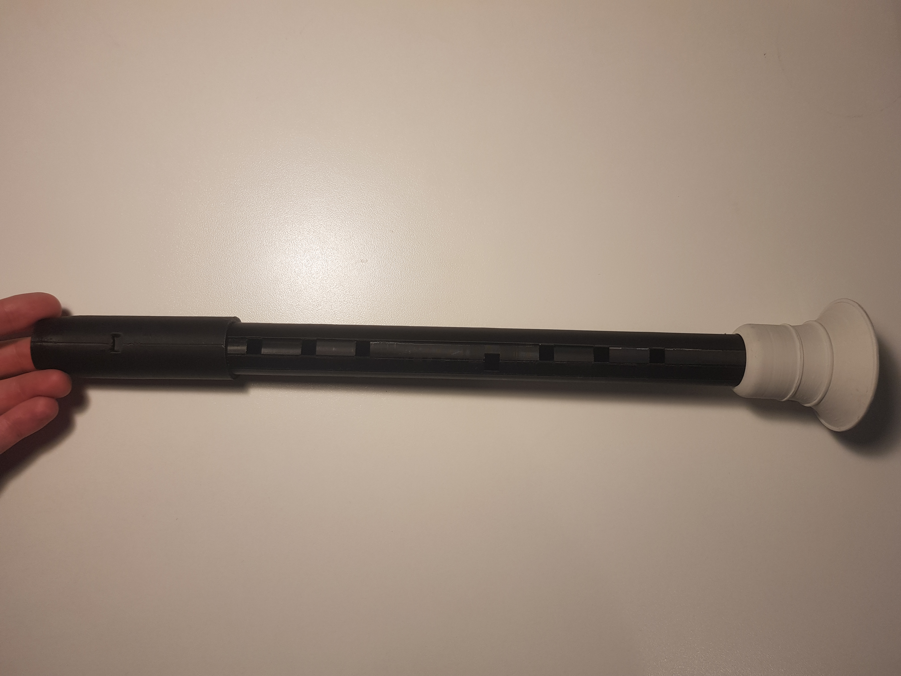
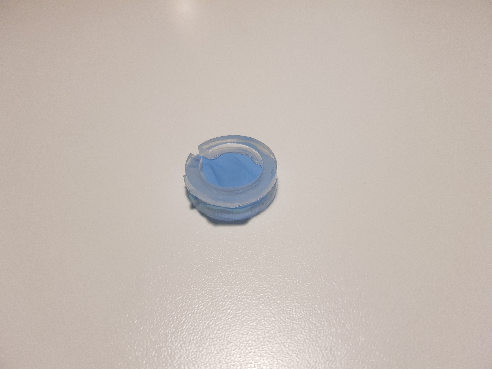
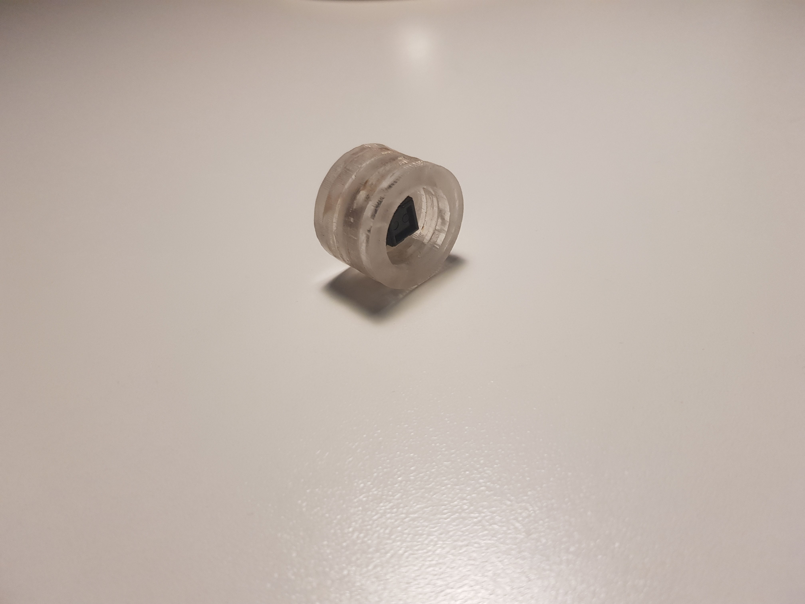
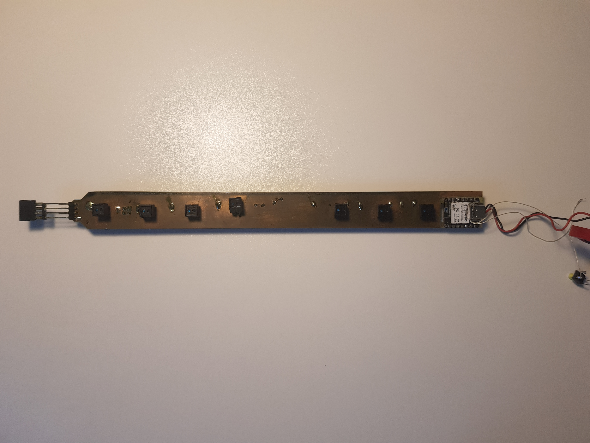
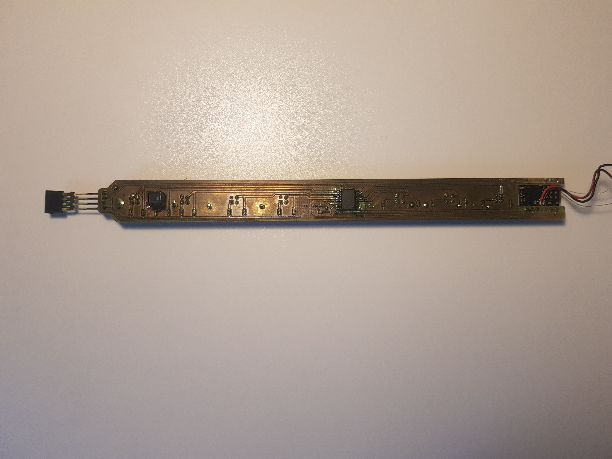

# Images of parts of the flute

Here you'll find some images of the different parts of the flute with some
basic explanations.

## The whole flute

Here you can see the shape of the whole flute:

## The blowing sensor

First you can see the balloon membrane glued between two rings:

Here you can see the sensor that is behing the membrane:

## PCB

Finally you can see the whole PCB that goes inside the flute.

